# Unimog SBU / U1300L Projects

[![CC BY-NC 4.0][cc-by-nc-shield]][cc-by-nc]

Some parts and projects designed for my U1300L - I hope you find them useful. Non-commercial use only.

Some printable parts are also available on [MakerWorld](https://makerworld.com/en/@nrh3k).

## Contents

- [Modular headlight system](#modular-headlight-system)
- [Dashboard cleanup](#dashboard-cleanup)
- [Snorkel lamp holder](#snorkel-lamp-holder)
- [OM366 pulley](#om366-pulley)
- [License](#license)

## Projects

### Modular headlight system

| Installed | Close-up | Model |
| --- | --- | --- |
|  |  |  |

A modular headlight replacement system for the stock SBU / U1300L headlight setup.

This was built around [J.W. Speaker Model 8631 Evolution](https://www.jwspeaker.com/products/led-headlight-model-8631-evolution/) and [J.W. Speaker Model 8910 Evolution 2](https://www.jwspeaker.com/products/led-headlights-model-8910-evolution-2/) lamps, both in 24V, but should work with any standard PAR46 round lamp and 5x7 rectangular lamp. The brackets replace the standard Hella buckets and reuse the same mounts. They do not need separate adjusters; there is enough flexibility in the existing brackets to aim them up/down and left/right.

I had the brackets cut by SendCutSend in .119 steel and powder-coated black for about $200. In .100 aluminum, they were about half that price.

The rest of the system is 3D printed and uses heat-set inserts to mount the retaining rings to the backing plate.

Files

- `headlight system/headlight dual holder.f3d`
- `headlight system/headlight dual holder v1.f3d`
- `headlight system/headlight dual holder separate retainers.f3d`
- `headlight system/headlight dual holder separate retainers v2 WIP.f3d`
- `headlight system/headlight dual holder separate retainers.step`

### Dashboard cleanup

Ongoing dashboard work to clean up and beautify the cab. This includes an old-style dash panel, gauge holders, warning light plugs, switch/knob parts, and small hole plugs for making the dashboard feel more deliberate instead of patched together.

The [light switch knob](https://makerworld.com/en/models/844162-unimog-sbu-light-switch-knob) and [dash plugs](https://makerworld.com/en/models/1440823-unimog-sbu-dash-plugs) are also on MakerWorld.

In addition to the dual Auber gauge holder, there is a lens cover. I printed it in smoked translucent filament to dim my very bright Auber gauges. My truck was also missing the blackout flap, so I printed a dimming flap out of the same translucent filament.

| Dual Auber holder | Auber lens cover | Installed Auber gauges |
| --- | --- | --- |
| 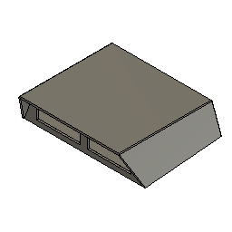 | 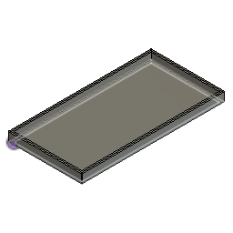 | 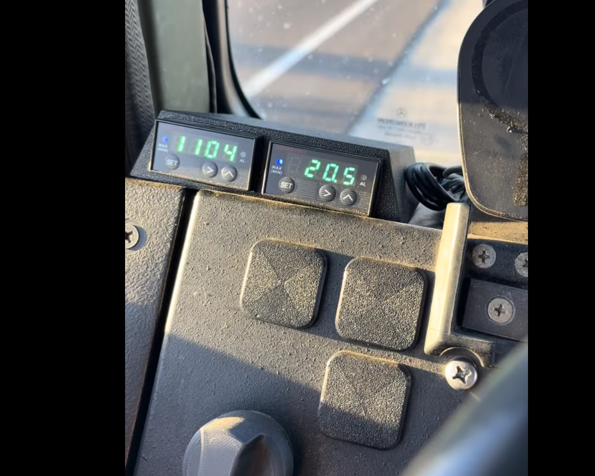 |

| Dash dimmer flap | Installed dash dimmer | Headlight knob |
| --- | --- | --- |
| 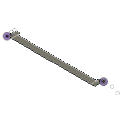 | 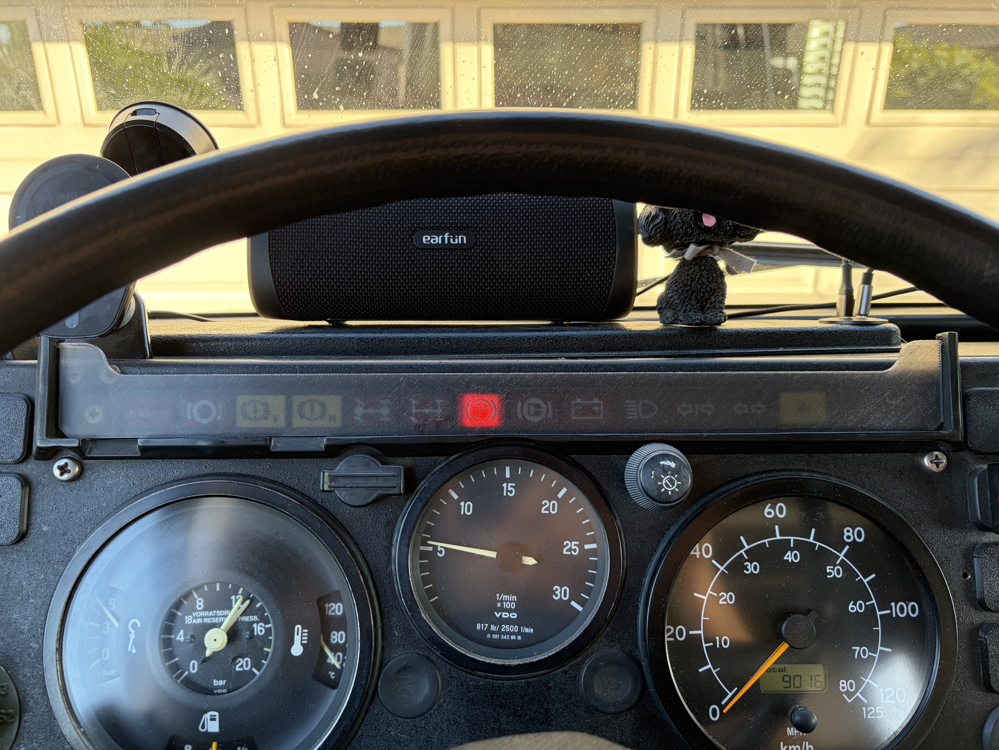 | 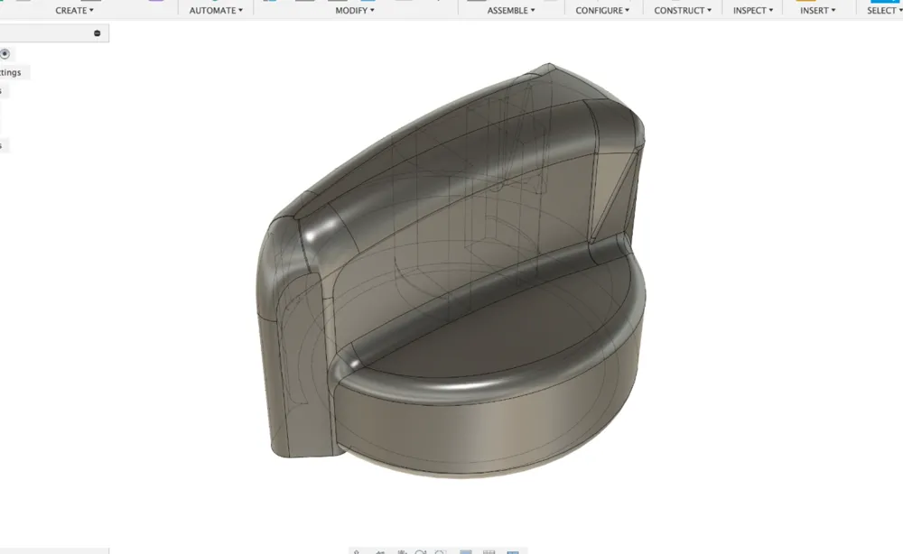 |

| Square warning light plug | Hole plug |
| --- | --- |
| 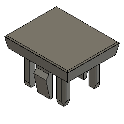 | 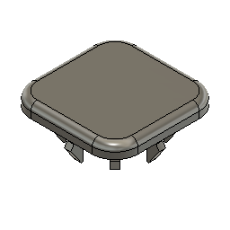 |

| 12.3mm round plug | 14.3mm round plug |
| --- | --- |
| 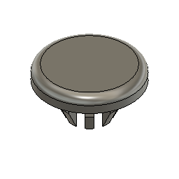 | 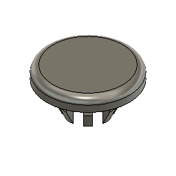 |

Files

- `dashboard/unimog dash old style.step`
- `dashboard/unimog dash old style.stl`
- `dashboard/unimog dash old style.f3d`
- `dashboard/double auber gauge holder.f3d`
- `dashboard/auber cover.f3d`
- `dashboard/u1300L dash dimmer.f3d`
- `dashboard/headlight knob.f3d`
- `dashboard/hole plug.f3d`
- `dashboard/round hole plug 12.3mm.f3d`
- `dashboard/round hole plug 14.3mm.f3d`
- `dashboard/square warning light plug.f3d`

### Snorkel lamp holder

| Model | Installed |
| --- | --- |
| 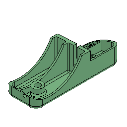 |  |

I broke the original snorkel lamp holder and did not realize replacements were still available, so I modeled my own. It turned out to be much harder than expected: the part has a lot of strange transitions, odd shapes, and packaging constraints that are not obvious until you try to reproduce it.

This is also available from my [MakerWorld profile](https://makerworld.com/en/@nrh3k).

Files

- `SBU snorkel lamp holder.f3d`

### OM366 pulley

When adding air conditioning, I needed a dual-groove water pump pulley for the OM366. Those pulleys are difficult to find, so this model captures the needed part geometry for that conversion work.

Files

- `om366 pulley.f3d`

## Notes

- These are project files from a real vehicle, not a complete commercial kit.
- Check dimensions, fitment, material choice, fasteners, and road-use legality before using any part on your own truck.
- Lighting and engine-accessory parts are safety-relevant. Verify your own installation carefully.

## License

This work is licensed under a [Creative Commons Attribution-NonCommercial 4.0 International License][cc-by-nc].

[cc-by-nc]: https://creativecommons.org/licenses/by-nc/4.0/
[cc-by-nc-shield]: https://img.shields.io/badge/License-CC%20BY--NC%204.0-lightgrey.svg
